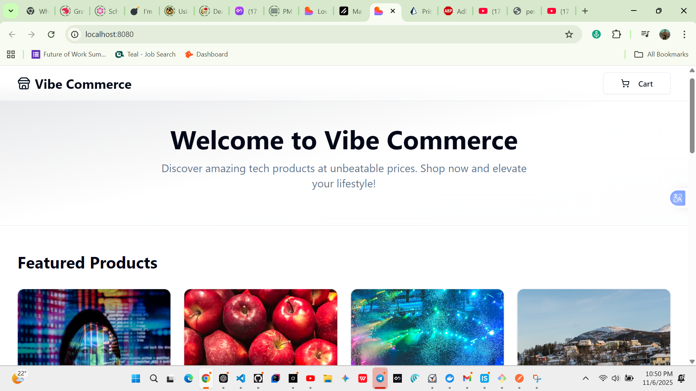

# Vibe Commerce

Vibe Commerce is a simple e-commerce web application built with **React**, **TypeScript**, and **Express/Prisma** for the backend. It allows users to browse products, add items to a cart, and complete a checkout process with a receipt.

---

## Screenshots

<div align="center">
  <div style="display: grid; grid-template-columns: repeat(auto-fit, minmax(280px, 1fr)); gap: 1.5rem; max-width: 1200px; margin: 2rem auto;">
    <div style="background: white; border-radius: 16px; overflow: hidden; box-shadow: 0 10px 20px rgba(0,0,0,0.1); transition: all 0.3s; border: 1px solid #e5e7eb;">
      
      <div style="padding: 1rem; background: linear-gradient(to right, #f3e8ff, #fce7f3);">
        <strong style="color: #7c3aed;">Home</strong> – Product Listing
      </div>
    </div>
    <div style="background: white; border-radius: 16px; overflow: hidden; box-shadow: 0 10px 20px rgba(0,0,0,0.1); transition: all 0.3s; border: 1px solid #e5e7eb;">
      
      <div style="padding: 1rem; background: linear-gradient(to right, #fce7f3, #fef3c7);">
        <strong style="color: #ec4899;">Cart</strong> – Manage Items
      </div>
    </div>
    <div style="background: white; border-radius: 16px; overflow: hidden; box-shadow: 0 10px 20px rgba(0,0,0,0.1); transition: all 0.3s; border: 1px solid #e5e7eb;">
      
      <div style="padding: 1rem; background: linear-gradient(to right, #d1fae5, #bbf7d0);">
        <strong style="color: #16a34a;">Checkout</strong> – Payment Flow
      </div>
    </div>
    <div style="background: white; border-radius: 16px; overflow: hidden; box-shadow: 0 10px 20px rgba(0,0,0,0.1); transition: all 0.3s; border: 1px solid #e5e7eb;">
      
      <div style="padding: 1rem; background: linear-gradient(to right, #ccfbff, #a5f3fc);">
        <strong style="color: #0891b2;">Receipt</strong> – Order Summary
      </div>
    </div>

  </div>
</div>

---

## Demo / Screen Recording

<div align="center" style="margin: 2.5rem 0;">
  <video controls style="max-width: 100%; border-radius: 16px; box-shadow: 0 15px 30px rgba(0,0,0,0.15); border: 1px solid #e5e7eb;" poster="./screenshots/home.png">
    <source src="https://github.com/Eyob-smax/vibe-ecommerce/raw/main/screenshots/demo.mp4" type="video/mp4">
    Your browser does not support the video tag.
  </source>
  </video>
  <p style="margin-top: 0.75rem; color: #6b7280; font-size: 0.9rem;">
    Full flow: browse → cart → checkout → receipt
  </p>
</div>

---

## ✨ Features

✅ Fetch products from backend  
✅ Add to cart / update quantity / remove items  
✅ Persistent server cart sessions  
✅ Checkout flow with receipt output  
✅ Stock validation  
✅ Order history stored in DB  
✅ Beautiful UI using shadcn + Tailwind

---

## 🧰 Tech Stack

### Frontend

- React + TypeScript
- Vite
- React Hooks
- shadcn/ui
- TailwindCSS

### Backend

- Node.js + Express
- Prisma ORM
- PostgreSQL

---

## Project Structure

backend/
├── prisma/
│ └── schema.prisma
├── src/
│ ├── controllers/
│ │ ├── cartController.ts
│ │ └── productController.ts
│ ├── routes/
│ │ ├── cartRoutes.ts
│ │ └── productRoutes.ts
│ └── index.ts
frontend/
├── src/
│ ├── components/
│ ├── hooks/
│ ├── lib/
│ │ ├── api.ts
│ │ └── types.ts
│ ├── pages/
│ │ └── index.tsx
│ └── App.tsx
├── package.json
README.md

---

## Getting Started

### Prerequisites

- Node.js v18+
- npm or yarn
- PostgreSQL (or Docker)

### Backend Setup

1. Clone the repository
   ```bash
   git clone https://github.com/EyobSmax/vibe-commerce.git
   cd vibe-commerce/backend
   ```
2. cd backend
3. npm install
4. npx prisma migrate dev --name init
5. npm run server
6. cd ../frontend
7. npm install
8. npm run dev
