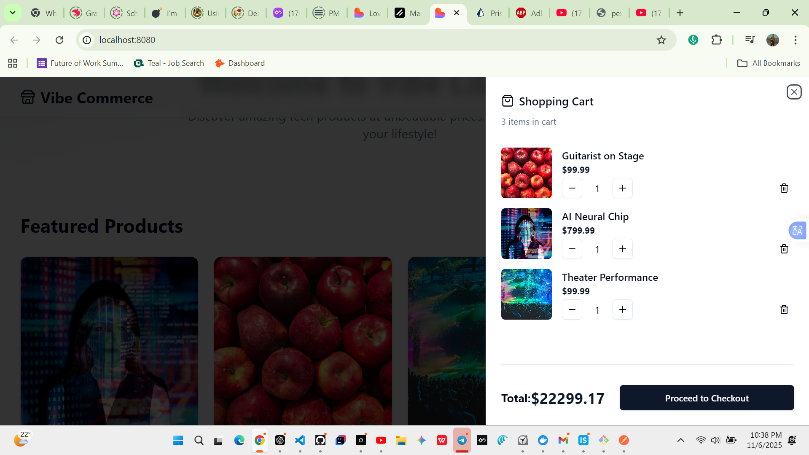
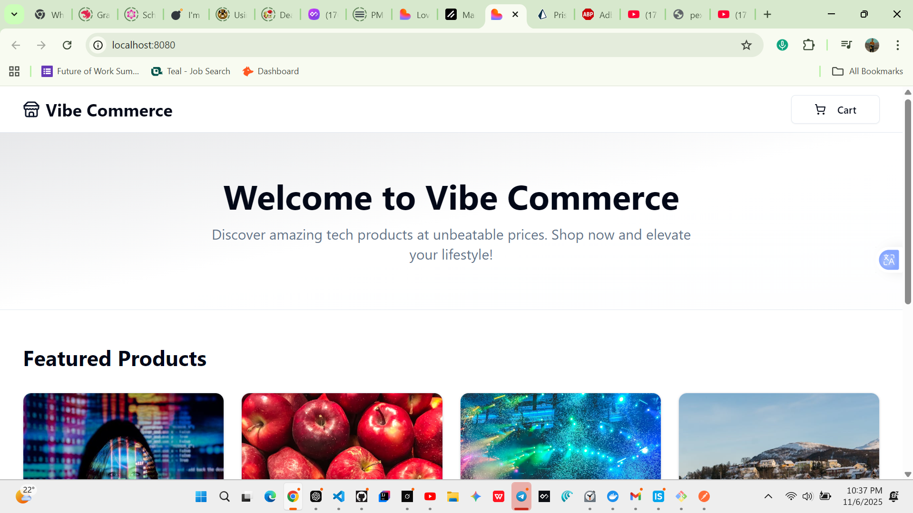

# Vibe Commerce

Vibe Commerce is a simple e-commerce web application built with **React**, **TypeScript**, and **Express/Prisma** for the backend. It allows users to browse products, add items to a cart, and complete a checkout process with a receipt.

---

## 📸 Screenshots

> Replace the placeholders with real files inside `/public/screens/`

### 🏠 Home (Product Listing)


### 🛍️ Cart



### 💳 Checkout Modal



### ✅ Receipt Modal


---

## 🎥 Demo / Screen Recording

> Upload your recording to YouTube, Loom, or GitHub and link it here.

**Video Demo:**  


---

## ✨ Features

✅ Fetch products from backend  
✅ Add to cart / update quantity / remove items  
✅ Persistent server cart sessions  
✅ Checkout flow with receipt output  
✅ Stock validation  
✅ Order history stored in DB  
✅ Beautiful UI using shadcn + Tailwind

---

## 🧰 Tech Stack

### Frontend

- React + TypeScript
- Vite
- React Hooks
- shadcn/ui
- TailwindCSS

### Backend

- Node.js + Express
- Prisma ORM
- PostgreSQL

---

## Project Structure

backend/
├── prisma/
│ └── schema.prisma
├── src/
│ ├── controllers/
│ │ ├── cartController.ts
│ │ └── productController.ts
│ ├── routes/
│ │ ├── cartRoutes.ts
│ │ └── productRoutes.ts
│ └── index.ts
frontend/
├── src/
│ ├── components/
│ ├── hooks/
│ ├── lib/
│ │ ├── api.ts
│ │ └── types.ts
│ ├── pages/
│ │ └── index.tsx
│ └── App.tsx
├── package.json
README.md

---

## Getting Started

### Prerequisites

- Node.js v18+
- npm or yarn
- PostgreSQL (or Docker)

### Backend Setup

1. Clone the repository
   ```bash
   git clone https://github.com/EyobSmax/vibe-commerce.git
   cd vibe-commerce/backend
   ```
2. cd backend
3. npm install
4. npx prisma migrate dev --name init
5. npm run server
6. cd ../frontend
7. npm install
8. npm run dev
